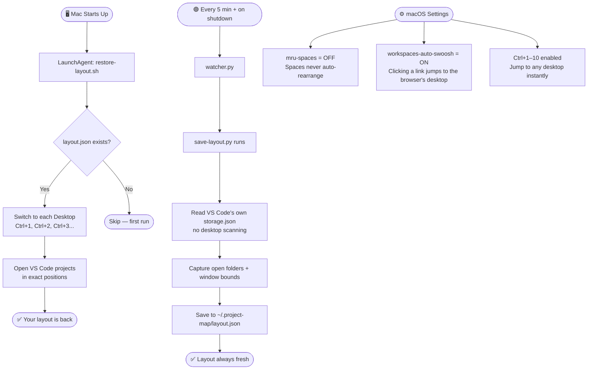

# 🗺️ Project Map

**Stop your apps from getting lost across desktops. Forever.**

> Built out of pure frustration — Chrome windows drifting to random desktops, VS Code sessions disappearing after every restart, macOS quietly reshuffling your carefully arranged spaces. Project Map locks everything in place.

---

## The Problem

You set up your Mac perfectly:
- Desktop 1 → Slack + WhatsApp
- Desktop 2 → VS Code (project A + project B, side by side)
- Desktop 3 → VS Code (project C + project D)
- Desktop 5 → Chrome (your work profile)
- Desktop 6 → Chrome (client profile) + Creative Cloud

Then you restart. Or click a Dock icon. Or macOS decides to "helpfully" rearrange things.

**Everything. Is. Gone.**

---

## What Project Map Does

```
┌─────────────────────────────────────────────────────────────┐
│                    YOUR MAC DESKTOP                         │
├──────────┬──────────┬──────────┬──────────┬──────────┬─────┤
│Desktop 1 │Desktop 2 │Desktop 3 │Desktop 4 │Desktop 5 │ ... │
│          │          │          │          │          │     │
│ Slack    │ VS Code  │ VS Code  │ Finder   │ Chrome   │     │
│ WhatsApp │ [Proj A] │ [Proj C] │          │ [Work]   │     │
│          │ [Proj B] │ [Proj D] │          │          │     │
└──────────┴──────────┴──────────┴──────────┴──────────┴─────┘
         ↑ Project Map keeps this EXACTLY like this, always.
```

### Every few minutes + on shutdown → saves layout
### On every boot → restores layout

---

## How It Works



---

## What's new in v2

Three reliability fixes over the first release:

1. **Restore no longer reopens stale sessions.** The saver now reads VS Code's own
   `storage.json` instead of scanning every desktop with AppleScript at shutdown.
   The old scan could never finish inside macOS's ~few-second shutdown window, so
   `layout.json` stayed frozen at its first snapshot. The watcher also snapshots
   every 5 minutes now, so the layout is always current.
2. **Ctrl+1–10 shortcuts actually persist.** `enable-shortcuts.sh` now writes via
   `defaults` (through `cfprefsd`) instead of editing the plist file directly — a
   direct edit was silently reverted by `activateSettings -u`.
3. **Link-follow restored.** `workspaces-auto-swoosh` is now `true`, so clicking a
   link brings you to the desktop where your browser already is. (v1 disabled it.)

> Note: the desktop lock is *positional* — `Ctrl+6` means "the 6th Space." Keep a
> fixed number of desktops (e.g. exactly 6). If you add or remove Spaces, the
> numbers shift.

---

## Requirements

- **macOS only** (Ventura 13+ recommended, works on Monterey 12+)
- **Apple Silicon or Intel Mac** — both work
- **Visual Studio Code** installed at `/Applications/Visual Studio Code.app`
- **Python 3** (ships with macOS — no install needed)
- Accessibility permissions for Terminal/your shell (System Settings → Privacy → Accessibility)

---

## Install

```bash
git clone https://github.com/prodcastmediaa-cyber/map-the-app.git
cd map-the-app
bash install.sh
```

That's it. The installer handles everything automatically.

---

## What the Installer Does (Automated)

| Step | What happens |
|------|-------------|
| Lock desktop order | `mru-spaces = false` — macOS stops reshuffling your spaces |
| Link-follow | `workspaces-auto-swoosh = true` — clicking a link jumps you to the desktop where your browser already lives |
| Enable shortcuts | `Ctrl+1` through `Ctrl+10` — jump to any desktop instantly |
| Save current layout | Reads VS Code's own state (`storage.json`), saves open folders to `~/.project-map/layout.json` |
| Boot restore agent | LaunchAgent that reopens VS Code windows on the right desktops at login |
| Layout watcher | Background process that saves your layout every 5 minutes and on shutdown |

---

## Manual Steps (2 only — takes 60 seconds)

### Step 1 — Log out and back in once
After install, log out and log back in. This activates the `Ctrl+1–10` keyboard shortcuts. You only do this once.

### Step 2 — Pin single-window apps to their desktop
For apps like Slack, WhatsApp, Messages that live on one specific desktop:

1. Go to that desktop
2. Right-click the app icon in the Dock
3. **Options → This Desktop**

> Skip Chrome — if you have multiple Chrome profiles open across desktops, you can't pin it to one. That's by design.

---

## After Install

| What you want | How |
|--------------|-----|
| Jump to Desktop 3 | `Ctrl+3` |
| See your saved layout | `cat ~/.project-map/layout.json` |
| Manually save layout now | `python3 scripts/save-layout.py` |
| Check restore logs | `cat ~/Library/Logs/project-map-restore.log` |
| Uninstall | `bash uninstall.sh` |

---

## File Structure

```
map-the-app/
├── install.sh                          # One-command installer
├── uninstall.sh                        # Clean removal
├── scripts/
│   ├── save-layout.py                  # Reads VS Code storage.json → layout.json
│   ├── restore-layout.sh               # Reads layout.json → restores windows
│   ├── watcher.py                      # Snapshots every 5 min + on shutdown
│   ├── enable-shortcuts.sh             # Enables Ctrl+1–10 in Mission Control
│   └── restart-clean.sh                # Saves layout, then a clean macOS restart
├── launchagents/
│   ├── com.projectmap.restore.plist    # Runs restore at login
│   └── com.projectmap.watcher.plist    # Runs watcher in background
└── CLAUDE.md                           # AI assistant installation guide
```

---

## Limitations

- **VS Code only** — other apps (Chrome, Slack) need the manual Dock pin (Step 2)
- **Desktops 1–10 supported** — Ctrl+1 through Ctrl+10 covers most setups
- **Window positions** are saved in logical pixels — if you change screen resolution, re-run `save-layout.py`
- **No Windows support** — Mac only for now

---

## Built By

[@prodcastmediaa](https://github.com/prodcastmediaa-cyber) — built this after one too many times losing Chrome to Desktop 6.

---

## License

MIT — use it, fork it, do whatever.
